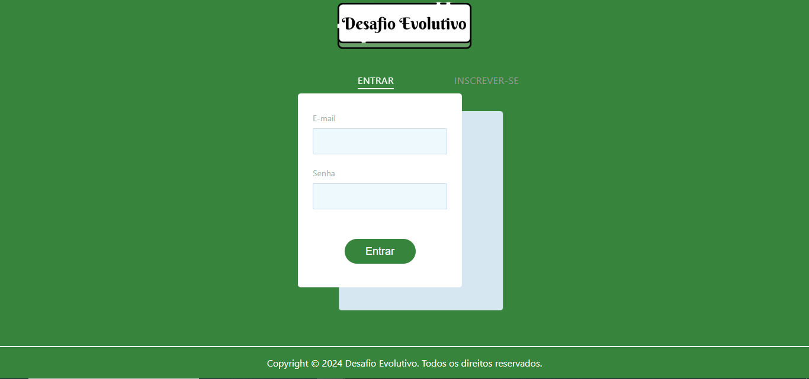

# Programação de Funcionalidades

Pré-requisitos: <a href="2-Especificação do Projeto.md"> Especificação do Projeto</a>, <a href="3-Projeto de Interface.md"> Projeto de Interface</a>, <a href="4-Metodologia.md"> Metodologia</a>, <a href="3-Projeto de Interface.md"> Projeto de Interface</a>, <a href="5-Arquitetura da Solução.md"> Arquitetura da Solução</a>

### Tela de Cadastro e Login (RF-001)

Responsável: Sharon e enzo

O acesso a tela de cadastro poderá ser feito através da opção de menu “Inscrever-se”. As estruturas de dados foram baseadas em HTML, CSS e JS.

Exemplo da tela de cadastro: 

Exemplo da tela de login: 

#### Requisito atendido

RF-001: O sistema deve permitir o cadastro e login na plataforma.

#### Artefatos da funcionalidade

●index.html

●cadastrologin.css

●cadastrologin.js

●scriptlogin.js

### Tela Área do usuário (RF-002)

Responsável: Sharon, Artur e Enzo

O acesso a tela área do usuário quando estiver logado. As estruturas de dados foram baseadas em HTML, CSS e JS.

Exemplo da tela área do usuário: 

#### Requisito atendido

RF-02	O sistema deve permitir que o usuário faça mudanças nos seus dados pessoais

#### Artefatos da funcionalidade

●areadousuario.html

●areadousuario.css

●areadousuario.js

